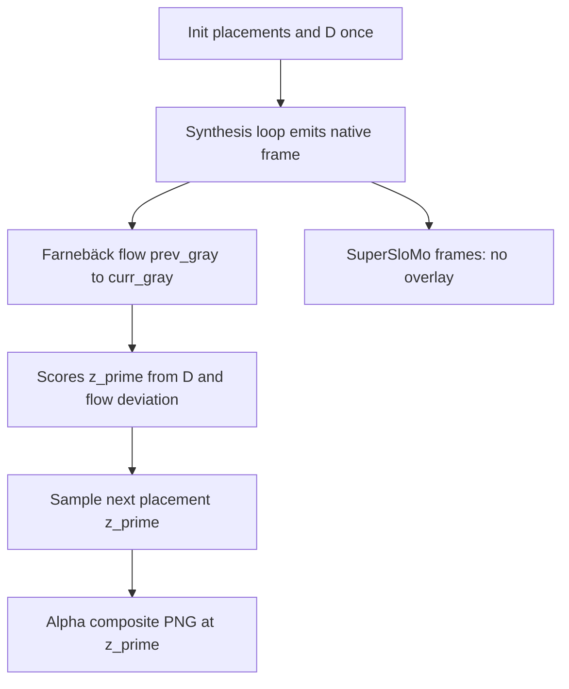

# Flow-guided PNG overlay (design plan)

Archived copy of the implementation plan for inference-only flow-guided sprite overlay on native video frames.

---

## Scope and constraints

- **Inference-only**: no new training, no changes to contrastive logits or how `output` is sampled for video segments (keep existing threshold + uniform-on-support behavior in `contrastive_video_textures/validate.py`).
- **Sprite scaling**: resize the PNG so **`max(width,height) = round(0.05 * min(H,W))`**, preserving aspect ratio (RGBA preserved).
- **Precompute once per run**: sample **100** valid top-left placements `(x,y)` on the **native video resolution** `(H,W)` (Gaussian centered on the frame center, clipped/rejected so the sprite stays in bounds). Optionally fix RNG with `--overlay_seed`.
- **Static `D`**: build **`100×100`** pairwise L2 distances between **full-frame RGB composites** of the sprite on a **black canvas** at each placement (same for all frames). This matches “random placements only” and stays cheap enough at typical resolutions; if needed later, add an optional downscale flag for `D` only.
- **Where to composite**: only in the loop that reads **`video[idx]`** into `frame_arr`. **Do not** composite frames appended from `intp_model(...)`. Duplicated native frames appended into `new_frames_intp` for the slomo timeline still originate from `video[idx]`—those **should** remain composited for consistency with `new_frames`; only **true interpolated** frames skip overlay.

## Core algorithm (Option A)

Maintain:

- `prev_gray`, `prev_z`, centroid `p` (sprite center in pixel coords).

For each **native** emitted frame `curr_rgb`:

1. If `prev_gray` is missing (first output frame): initialize `z` uniformly over `{0..99}` (or optionally `--overlay_init_center_bias` later).
2. Else compute dense optical flow `F_{prev→curr}` with **`cv2.calcOpticalFlowFarneback`** on grayscale (start with defaults; expose `--overlay_flow_*` pyr_scale/levels/winsize if tuning is needed).
3. Bilinear sample velocity at `p`: `v ≈ F(p)`.
4. Predict `p_pred = p + v`.
5. For each candidate placement `z'`, let `c(z')` be the sprite center for that placement’s `(x,y)`. Score

   `E(z') = D[prev_z,z']/sigma_d + ||c(z') - p_pred||^2 / sigma_f`

   (both terms in pixel space; `sigma_d` scales the **precomputed** `D` entries).

6. Convert to probabilities `P(z') ∝ exp(-E(z'))`, normalize, **sample** `z'` with `np.random.choice` using `p=P` (mask/placement chain uses Gibbs sampling; video branch stays unchanged).

7. Alpha-composite the scaled PNG at placement `z'` onto `curr_rgb`, update state.

**Local-time note**: because consecutive displayed native frames can correspond to **non-consecutive** source indices when `subsample_rate>1`, flow is still computed on **what is shown next**, which matches “primarily local in time” along the output timeline.

## Files to add/change

1. **New module**: `contrastive_video_textures/utils/flow_overlay.py`

   - `load_and_scale_sprite(path, max_side) -> RGBA PIL`
   - `sample_placements(num, H, W, sprite_wh, rng) -> np.ndarray [100,2]` top-left corners
   - `render_placement_layer(sprite_rgba, placement_xy, H, W) -> RGB uint8`
   - `build_distance_matrix(layers_or_rgb_tensors) -> [100,100]`
   - `compute_flow(prev_gray, curr_gray) -> flow_xy`
   - `bilinear_sample(flow, pt) -> v`
   - `transition_probs(prev_z, centers, D, p_pred, sigma_d, sigma_f) -> probs`
   - `composite_on_frame(frame_rgb_uint8, sprite, xy) -> PIL.Image`

2. **Wire into validation**: `contrastive_video_textures/validate.py`

   - After `video` dimensions are known (`video.shape`), optionally construct overlay state when `args.overlay_png` is set.
   - Refactor slightly so SuperSloMo `int_frames` append **without** calling composite helper.
   - In the native-frame emission loop, apply overlay **before** `Image.fromarray(...)` / append.

3. **CLI**: `contrastive_video_textures/main.py`

   - `--overlay_png` (default `None`)
   - `--overlay_num_placements` (default `100`)
   - `--overlay_seed` (optional `int`)
   - `--overlay_xy_sigma_frac` (Gaussian std as fraction of `min(H,W)` for sampling top-left offsets around center; tune default e.g. `0.15`)
   - `--overlay_sigma_d`, `--overlay_sigma_f` (temperature-like scales for `D` term vs flow deviation)

## Git workflow (original request)

From repo root:

- `git fetch origin && git checkout main && git pull`
- `git checkout -b feature/flow-overlay-native-frames` (name adjustable)

## Testing checklist (manual)

- Run a short validation that previously worked **without** `--overlay_png` (no behavior change).
- Run with `--overlay_png` and `--interpolation` enabled: verify **`new_frames`** looks composited; inspect interpolated export folder to confirm **SuperSloMo inserts** have **no** sprite while neighboring duplicated native frames do.
- Sanity: first frame always gets a sprite; placement evolves smoothly on mostly-static backgrounds and reacts when background motion is strong.

---

## Follow-ups implemented after this plan (not in original doc)

- Random **vertical flip** (50%) and **±10° rotation** of the sprite once per run after scaling (`augment_sprite_flip_rotate` in `flow_overlay.py`).
- **`flow_overlay_runner`** must be constructed in `validate.py` whenever `--overlay_png` is set (including `model_type=1`).
- Optional suppression of torchvision `_functional_video` / `_transforms_video` deprecation warnings when launching via `main.py`.
